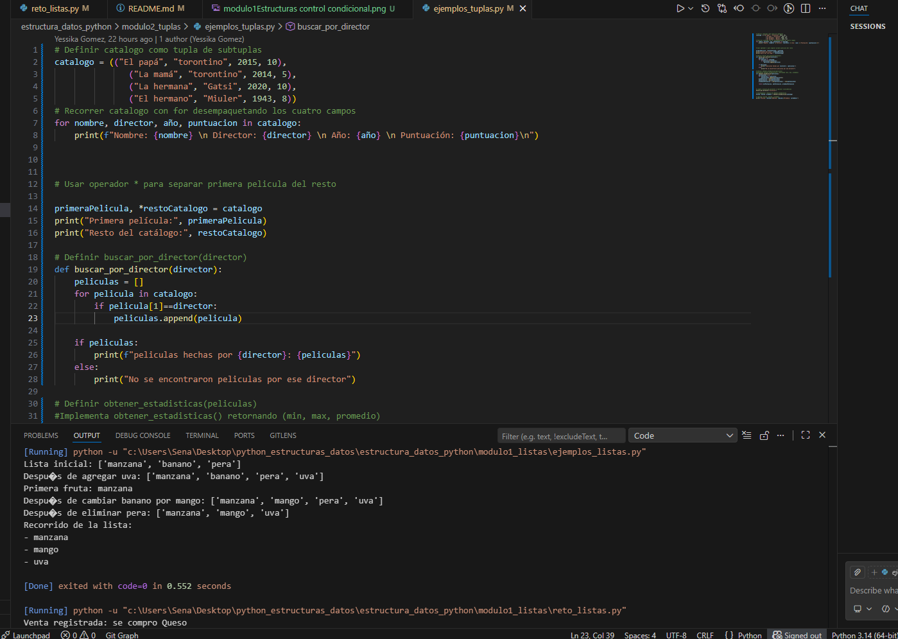
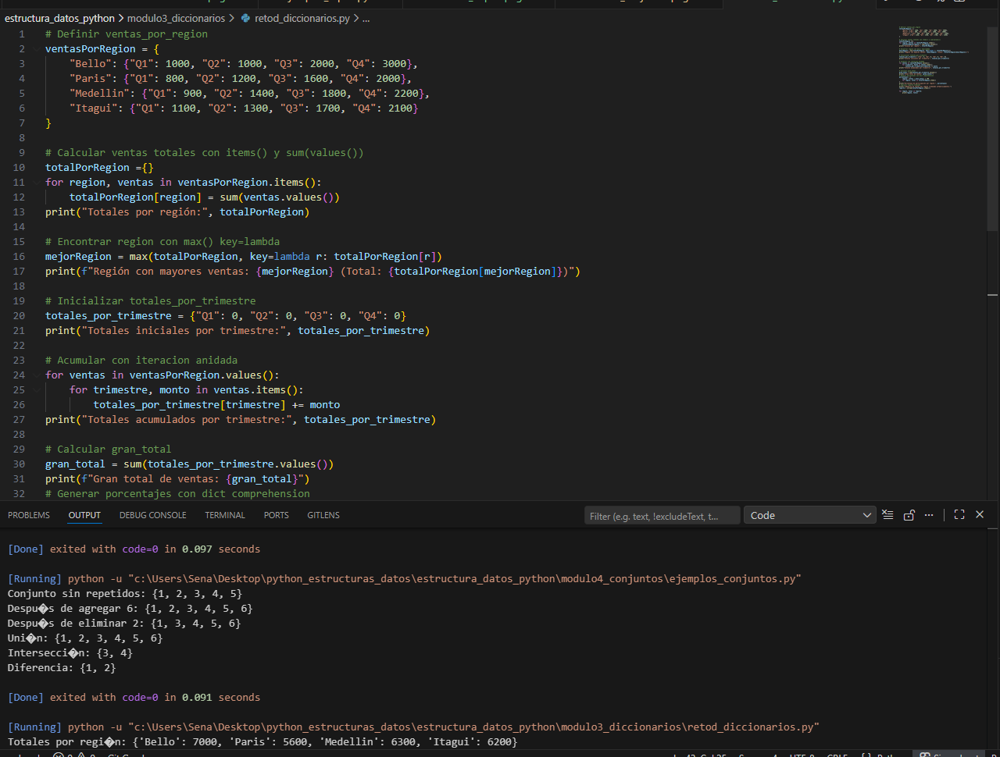
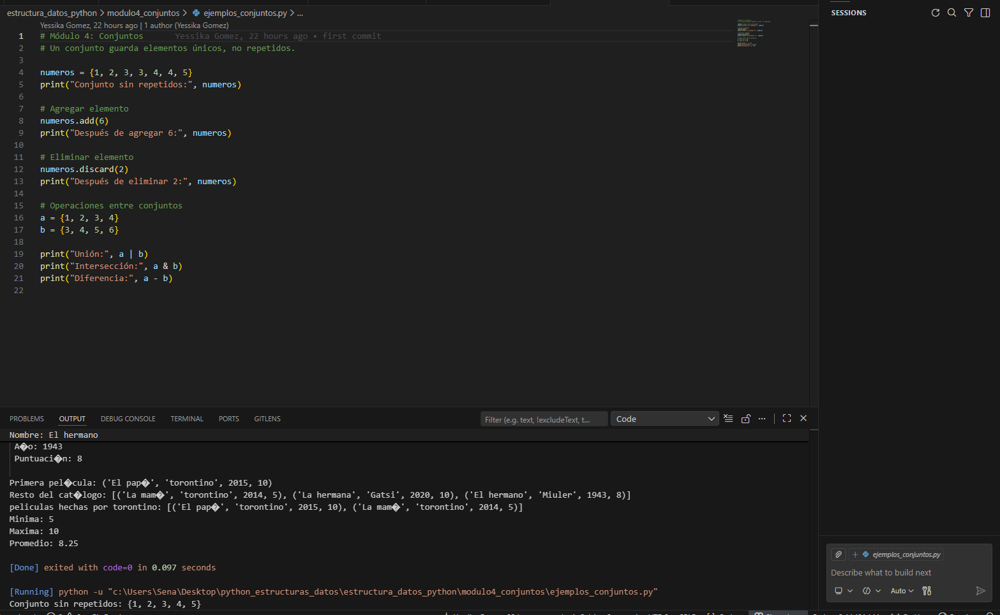
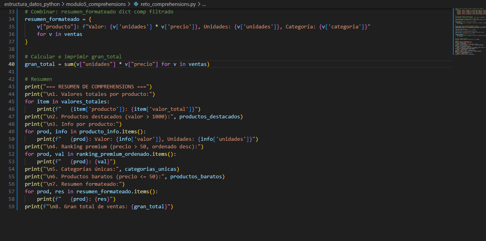

# GA1 220501093-04 AA1 EV03 – Fundamentos de Python: Estructuras de Datos en Python

## Descripción del proyecto

Este proyecto fue desarrollado por Andrés Felipe Portillo Rodiño como evidencia de aprendizaje para la actividad del SENA sobre estructuras de datos en Python.

El objetivo principal del proyecto es practicar el uso de listas, tuplas, diccionarios, conjuntos y comprehensions mediante ejercicios y ejemplos desarrollados en Python.

---

## Estructura del proyecto

```text
estructura_datos_python/
│── main.py
│── README.md
│
├── images/
│   ├── .gitkeep
│   ├── modulo1Estructuras control condicional.png
│   ├── modulo2_.tuplas.png
│   ├── modulo3_diccionarios.png
│   ├── modulo4_conjuntos.png
│   └── modulo5_comprehensions.png
│
├── modulo1_listas/
│   ├── ejemplos_listas.py
│   └── reto_listas.py
│
├── modulo2_tuplas/
│   └── ejemplos_tuplas.py
│
├── modulo3_diccionarios/
│   └── retod_diccionarios.py
│
├── modulo4_conjuntos/
│   ├── ejemplos_conjuntos.py
│   └── reto_conjuntos.py
│
└── modulo5_comprehensions/
    ├── ejemplos_comprehensions.py
    └── reto_comprehensions.py
```

---

## Temas aprendidos

### Listas

Las listas permiten almacenar varios datos dentro de una sola variable. Son estructuras ordenadas y mutables.

Conceptos trabajados:
- append()
- índices positivos y negativos
- len()
- count()
- index()
- ciclos for

Ejemplo trabajado:
- Registro y promedio de notas.

---

### Tuplas

Las tuplas permiten almacenar datos ordenados que no se pueden modificar después de ser creados.

Ejemplo trabajado:
- Información de productos.

---

### Diccionarios

Los diccionarios almacenan información utilizando claves y valores.

Conceptos trabajados:
- acceso por claves
- modificación de datos
- recorridos con ciclos

Ejemplo trabajado:
- Inventario y registro de información.

---

### Conjuntos

Los conjuntos almacenan elementos únicos sin repetir.

Operaciones trabajadas:
- unión
- intersección
- diferencia

Ejemplo trabajado:
- Comparación de estudiantes inscritos en cursos.

---

### Comprehensions

Las comprehensions permiten crear listas, conjuntos o diccionarios de forma más corta y organizada.

Ejemplos trabajados:
- listas de números pares
- cuadrados de números
- diccionarios automáticos

---

## Evidencias de ejecución

### Módulo 1 - Listas


### Módulo 2 - Tuplas


### Módulo 3 - Diccionarios


### Módulo 4 - Conjuntos


### Módulo 5 - Comprehensions


---

## Cómo ejecutar el proyecto

Abrir una terminal dentro de la carpeta del proyecto y ejecutar los siguientes comandos:

```bash
python modulo1_listas/reto_listas.py

python modulo2_tuplas/ejemplos_tuplas.py

python modulo3_diccionarios/retod_diccionarios.py

python modulo4_conjuntos/reto_conjuntos.py

python modulo5_comprehensions/reto_comprehensions.py

python main.py
```

---

## Reflexión personal

Con esta actividad aprendí a utilizar diferentes estructuras de datos en Python y comprendí la importancia de cada una según la necesidad del programa.

También reforcé habilidades relacionadas con la organización de proyectos, creación de carpetas, documentación en README.md y desarrollo de ejercicios prácticos utilizando Visual Studio Code.

Este proyecto me permitió mejorar mi lógica de programación y aplicar conceptos fundamentales del lenguaje Python mediante ejercicios prácticos.